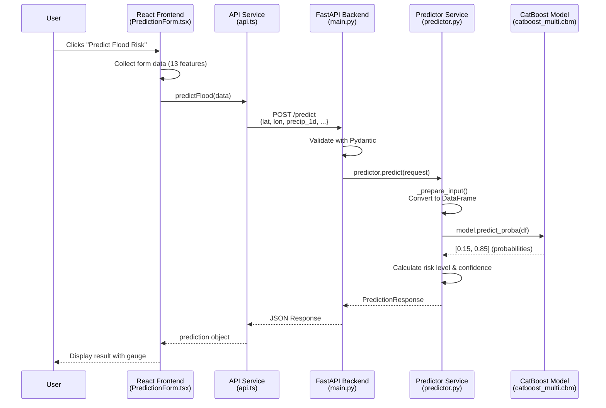

# 🔄 Complete Request Flow: Frontend → Backend → Model → Response

## **End-to-End Flow Diagram**



---

## **Step-by-Step Code Flow**

### **STEP 1: User Fills Form (Frontend)**

**File:** `frontend/src/components/PredictionForm.tsx`

```typescript
// User fills form with 13 features
const [formData, setFormData] = useState<PredictionRequest>({
    lat: 23.8103,           // Latitude
    lon: 90.4125,           // Longitude
    date: 180,              // Day number
    elevation: 10.5,        // Elevation in meters
    slope: 0.5,             // Slope in degrees
    landcover: 11,          // Land cover type (categorical)
    precip_1d: 50.0,        // 1-day precipitation
    precip_3d: 120.0,       // 3-day precipitation
    precip_7d: 200.0,       // 7-day precipitation
    precip_14d: 300.0,      // 14-day precipitation
    dis_last: 1500.0,       // Last river discharge
    dis_trend_3: 100.0,     // 3-day discharge trend
    dayofyear: 180,         // Day of year
});

// User clicks "Predict Flood Risk" button
const handleSubmit = (e: FormEvent) => {
    e.preventDefault();
    onSubmit(formData);  // Calls handlePrediction in App.tsx
};
```

---

### **STEP 2: App.tsx Handles Submission**

**File:** `frontend/src/App.tsx`

```typescript
const handlePrediction = async (data: PredictionRequest) => {
    setIsLoading(true);  // Show loading spinner
    setError(null);
    
    try {
        // Call API service
        const prediction = await predictFlood(data);
        setResult(prediction);  // Store result
        
        // Save to localStorage for history
        const historyEntry = {
            id: Date.now().toString(),
            timestamp: new Date().toISOString(),
            location: `${data.lat}, ${data.lon}`,
            request: data,
            response: prediction,
        };
        localStorage.setItem('prediction-history', JSON.stringify(historyEntry));
        
    } catch (err) {
        setError('Prediction failed');
    } finally {
        setIsLoading(false);
    }
};
```

---

### **STEP 3: API Service Sends HTTP Request**

**File:** `frontend/src/services/api.ts`

```typescript
const API_BASE_URL = 'http://localhost:8000';

export async function predictFlood(data: PredictionRequest): Promise<PredictionResponse> {
    // Send POST request to backend
    const response = await fetch(`${API_BASE_URL}/predict`, {
        method: 'POST',
        headers: {
            'Content-Type': 'application/json',
        },
        body: JSON.stringify(data),  // Convert to JSON
    });
    
    // Handle response
    if (!response.ok) {
        throw new ApiError(response.status, 'Request failed');
    }
    
    return response.json();  // Parse JSON response
}
```

**HTTP Request looks like:**
```http
POST http://localhost:8000/predict
Content-Type: application/json

{
  "lat": 23.8103,
  "lon": 90.4125,
  "date": 180,
  "elevation": 10.5,
  "slope": 0.5,
  "landcover": 11,
  "precip_1d": 50.0,
  "precip_3d": 120.0,
  "precip_7d": 200.0,
  "precip_14d": 300.0,
  "dis_last": 1500.0,
  "dis_trend_3": 100.0,
  "dayofyear": 180
}
```

---

### **STEP 4: FastAPI Receives Request**

**File:** `backend/app/main.py`

```python
@app.post("/predict", response_model=PredictionResponse, tags=["Prediction"])
async def predict_flood(request: PredictionRequest):
    """
    Endpoint receives HTTP POST request
    """
    try:
        # Step 4.1: Pydantic automatically validates request
        # - Checks all fields are present
        # - Validates data types (float, int)
        # - Raises error if validation fails
        
        # Step 4.2: Check if model is loaded
        if not predictor.model_loaded:
            raise HTTPException(
                status_code=503,
                detail="Model not loaded"
            )
        
        # Step 4.3: Call predictor service
        prediction = predictor.predict(request)
        
        # Step 4.4: Log prediction
        logger.info(f"Prediction: probability={prediction.flood_probability:.3f}")
        
        # Step 4.5: Return response (auto-converted to JSON)
        return prediction
        
    except Exception as e:
        logger.error(f"Prediction error: {str(e)}")
        raise HTTPException(status_code=500, detail=str(e))
```

**Pydantic Validation (Automatic):**
```python
# File: backend/app/models.py
class PredictionRequest(BaseModel):
    lat: float          # Must be float
    lon: float          # Must be float
    date: int           # Must be int
    elevation: float    # Must be float
    # ... etc
    
    # If user sends wrong type, Pydantic raises error:
    # {"detail": "field 'lat' must be a float"}
```

---

### **STEP 5: Predictor Prepares Data**

**File:** `backend/app/predictor.py`

```python
def predict(self, request: PredictionRequest) -> PredictionResponse:
    """Generate flood prediction"""
    
    # Step 5.1: Prepare input data
    input_df = self._prepare_input(request)
    
    # Step 5.2: Get prediction from model
    probabilities = self.model.predict_proba(input_df)
    flood_probability = float(probabilities[0][1])
    
    # Step 5.3: Calculate confidence
    confidence = abs(flood_probability - 0.5) * 2
    
    # Step 5.4: Determine risk level
    risk_level = self._calculate_risk_level(flood_probability)
    
    # Step 5.5: Create response
    return PredictionResponse(
        flood_probability=flood_probability,
        risk_level=risk_level,
        is_flood_predicted=flood_probability >= 0.5,
        confidence=confidence
    )
```

**Data Preparation:**
```python
def _prepare_input(self, request: PredictionRequest) -> pd.DataFrame:
    """Convert request to DataFrame"""
    
    # Step 5.1.1: Extract all features
    data = {
        'lat': request.lat,
        'lon': request.lon,
        'date': request.date,
        'elevation': request.elevation,
        'slope': request.slope,
        'landcover': request.landcover,
        'precip_1d': request.precip_1d,
        'precip_3d': request.precip_3d,
        'precip_7d': request.precip_7d,
        'precip_14d': request.precip_14d,
        'dis_last': request.dis_last,
        'dis_trend_3': request.dis_trend_3,
        'dayofyear': request.dayofyear
    }
    
    # Step 5.1.2: Create DataFrame with correct column order
    df = pd.DataFrame([data], columns=self.feature_names)
    
    # Step 5.1.3: Handle missing values
    df = df.replace([np.inf, -np.inf], np.nan)
    df = df.fillna(0.0)
    
    return df
```

**DataFrame looks like:**
```
   lat      lon    date  elevation  slope  landcover  precip_1d  precip_3d  ...
0  23.8103  90.4125  180   10.5      0.5    11         50.0       120.0     ...
```

---

### **STEP 6: CatBoost Model Makes Prediction**

```python
# Model is already loaded at startup
self.model = CatBoostClassifier()
self.model.load_model('models/catboost_multi.cbm')

# Prediction
probabilities = self.model.predict_proba(input_df)
# Returns: [[0.15, 0.85]]
#           ↑      ↑
#        No Flood  Flood
```

**What happens inside CatBoost:**
1. **Categorical Encoding**: Converts `landcover=11` using target statistics
2. **Tree Traversal**: Passes data through 1000+ decision trees
3. **Aggregation**: Combines predictions from all trees
4. **Probability Output**: Returns probability for each class

**Example:**
```
Input: lat=23.8, precip_14d=450mm, landcover=11 (urban)

Tree 1: "precip_14d > 300? Yes → High risk (0.9)"
Tree 2: "elevation < 20? Yes → High risk (0.8)"
Tree 3: "landcover == urban? Yes → Medium risk (0.6)"
... (1000+ trees)

Average: 0.85 → 85% flood probability
```

---

### **STEP 7: Calculate Risk Level**

```python
def _calculate_risk_level(self, probability: float) -> str:
    """Determine risk level"""
    if probability < 0.3:      # Low threshold
        return "Low"
    elif probability < 0.7:    # Medium threshold
        return "Medium"
    else:
        return "High"

# Example:
# probability = 0.85 → "High"
# probability = 0.45 → "Medium"
# probability = 0.15 → "Low"
```

**Confidence Calculation:**
```python
# Confidence = distance from decision boundary (0.5)
confidence = abs(flood_probability - 0.5) * 2

# Examples:
# probability = 0.9 → confidence = |0.9 - 0.5| * 2 = 0.8 (80% confident)
# probability = 0.1 → confidence = |0.1 - 0.5| * 2 = 0.8 (80% confident)
# probability = 0.5 → confidence = |0.5 - 0.5| * 2 = 0.0 (0% confident - uncertain)
```

---

### **STEP 8: Return Response to Frontend**

**Backend Response:**
```python
return PredictionResponse(
    flood_probability=0.85,
    risk_level="High",
    is_flood_predicted=True,
    confidence=0.70
)
```

**JSON Response:**
```json
{
  "flood_probability": 0.85,
  "risk_level": "High",
  "is_flood_predicted": true,
  "confidence": 0.70
}
```

---

### **STEP 9: Frontend Displays Result**

**File:** `frontend/src/components/ResultCard.tsx`

```typescript
// Frontend receives response
const result = {
    flood_probability: 0.85,
    risk_level: "High",
    is_flood_predicted: true,
    confidence: 0.70
};

// Display to user
<div className="result-card">
    <h2>Risk Level: High</h2>
    <div className="gauge">
        {/* Visual gauge showing 85% */}
    </div>
    <p>Flood Probability: 85%</p>
    <p>Confidence: 70%</p>
</div>
```

---

## **Complete Flow Summary**

```
1. User fills form → 13 features collected
   ↓
2. User clicks "Predict" → handleSubmit() called
   ↓
3. App.tsx → handlePrediction(data)
   ↓
4. api.ts → fetch('http://localhost:8000/predict', {POST, JSON})
   ↓
5. FastAPI → @app.post("/predict") receives request
   ↓
6. Pydantic → Validates all fields automatically
   ↓
7. predictor.predict(request) → Called
   ↓
8. _prepare_input() → Convert to DataFrame
   ↓
9. model.predict_proba(df) → CatBoost prediction
   ↓
10. Calculate risk level & confidence
   ↓
11. Return PredictionResponse → Auto-converted to JSON
   ↓
12. FastAPI → Send JSON response
   ↓
13. api.ts → Parse JSON
   ↓
14. App.tsx → setResult(prediction)
   ↓
15. ResultCard → Display visual result to user
```

---

## **Timing Breakdown**

| Step | Component | Time |
|------|-----------|------|
| 1-3 | Frontend processing | ~5ms |
| 4 | HTTP request (network) | ~10-20ms |
| 5-6 | FastAPI validation | ~2ms |
| 7-8 | Data preparation | ~3ms |
| 9 | CatBoost prediction | ~30-50ms |
| 10-11 | Response creation | ~2ms |
| 12 | HTTP response (network) | ~10-20ms |
| 13-15 | Frontend rendering | ~5ms |
| **TOTAL** | **End-to-end** | **~70-110ms** |

---

## **Error Handling Flow**

```
If error occurs at any step:
    ↓
Backend catches exception
    ↓
FastAPI returns HTTP error (500/503)
    ↓
Frontend api.ts throws ApiError
    ↓
App.tsx catches error
    ↓
Display error message to user
```

---

## **Key Technologies Used**

| Layer | Technology | Purpose |
|-------|------------|---------|
| **Frontend** | React + TypeScript | UI components |
| **HTTP Client** | Fetch API | Send requests |
| **Backend** | FastAPI | REST API server |
| **Validation** | Pydantic | Data validation |
| **Data Processing** | Pandas + NumPy | DataFrame operations |
| **ML Model** | CatBoost | Flood prediction |
| **Serialization** | JSON | Data format |

---

## **Data Flow Example**

**Input (Frontend):**
```typescript
{
  lat: 23.8103,
  lon: 90.4125,
  precip_14d: 450.0,
  landcover: 11,
  ...
}
```

**↓ HTTP POST ↓**

**Backend Receives:**
```python
PredictionRequest(
    lat=23.8103,
    lon=90.4125,
    precip_14d=450.0,
    landcover=11,
    ...
)
```

**↓ Convert to DataFrame ↓**

```
   lat      lon    precip_14d  landcover  ...
0  23.8103  90.4125  450.0      11        ...
```

**↓ CatBoost Prediction ↓**

```
Probabilities: [0.15, 0.85]
               ↑      ↑
            No Flood  Flood
```

**↓ Process Result ↓**

```python
PredictionResponse(
    flood_probability=0.85,
    risk_level="High",
    is_flood_predicted=True,
    confidence=0.70
)
```

**↓ JSON Response ↓**

```json
{
  "flood_probability": 0.85,
  "risk_level": "High",
  "is_flood_predicted": true,
  "confidence": 0.70
}
```

**↓ Display to User ↓**

```
🔴 HIGH RISK
Flood Probability: 85%
Confidence: 70%
```

---

This is the complete end-to-end flow of your Bangladesh Flood Predictor application!
